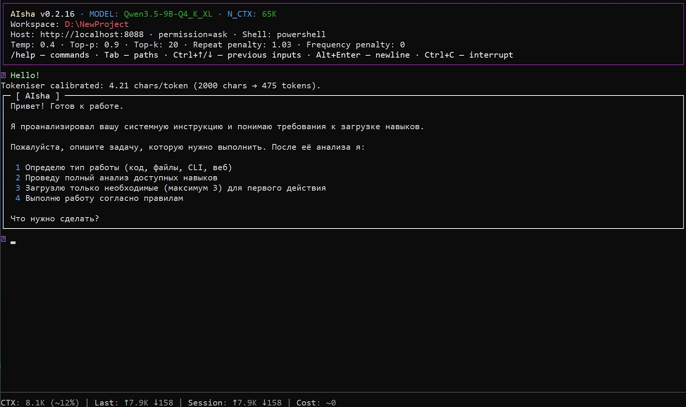

# AISHA

> 🇷🇺 [Русская версия](README_RU.md)

A local console AI agent in Python 3.11+. Works with an external
[llama-server](https://github.com/ggml-org/llama.cpp) (llama.cpp) via an
OpenAI-compatible REST API. This is **not a web app**: the entire logic is a loop
of "model request → tool calls → results → model again" in a single process.

Version: `0.2.13`.

[](aisha.jpg)

## Features

- **Files** — read, write, inline editing, listing, `glob` search, and `grep`;
- **Shell** — run commands (`powershell`/`cmd` on Windows; `/bin/sh` on other OSes), timeouts, output trimming, confirmation for dangerous commands;
- **Web** — DuckDuckGo search and page fetching with SSRF protection;
- **Memory** — persistent blocks (global and project-scoped) with project priority;
- **Skills** — reusable instructions in `SKILL.md`;
- **Multi-step tasks** — todo list and clarifying questions to the user;
- **Native tool calling** — the model invokes tools directly via API;
- **Automatic history compaction** when approaching the context limit;
- **Two modes** — one-shot (prompt passed as argument) and interactive REPL.

## Requirements

- Python **3.11+**;
- a running **llama-server** (llama.cpp) with OpenAI-compatible API and tool calling support.

### Option 1: from PyPI (recommended)

```bash
pip install aisha
```

The simplest way: the package is installed from https://pypi.org/project/aisha/ with all dependencies, the `aisha` command is available globally.

### Option 2: from source (repository)

```bash
pip install -e ".[dev]"   # src-layout: without this the `aisha` package won't import
```

Entry point — `aisha = "aisha.cli:main"` (see `pyproject.toml`).

## Running llama-server

Before using aisha you need to start the server, e.g.:

```bash
llama-server \
  --model ./models/Qwen3.5-9B-Q4_K_XL.gguf \
  --port 8088 \
  --n-gpu-layers 99
```

By default aisha expects the server at `http://localhost:8088`. Check connectivity:

```bash
aisha --doctor
```

## Quick Start

```bash
aisha "explain what this project does"   # one-shot: single request and exit
aisha                                    # no arguments — interactive REPL
python -m aisha ...                      # equivalent entry point
```

## CLI

```
aisha [prompt...] [flags]
```

| Flag | Description |
|---|---|
| `prompt` (positional) | query; without it REPL starts |
| `--server URL` | llama-server address (default `http://localhost:8088`) |
| `--model NAME` | model name on the server |
| `--api-key KEY` | API key for the server (if auth is required) |
| `--skip-health` | skip `/health` check (for incompatible servers) |
| `-r`, `--read-only` | read-only mode (safe tools only) |
| `--permission auto\|ask\|deny` | shell command execution mode |
| `--shell powershell\|cmd` | default shell |
| `--tools-only` | list tools and exit |
| `--doctor` | diagnose server connection |
| `--tool-call-test` | together with `--doctor`: test tool calling |
| `--no-color` | disable colors |
| `--debug` | debug mode: model reasoning, request/response dumps, tracebacks |
| `--version` | show version |

## Configuration

Priority (each layer deep-merges with the previous):

```
DEFAULTS  ←  ~/.aisha/config.toml  ←  <workspace>/.aisha/aisha.toml  ←  env AISHA_*  ←  CLI flags
```

Full example of `~/.aisha/config.toml`:

```toml
[server]
base_url = "http://localhost:8088"
model = "Qwen3.5-9B-Q4_K_XL"
api_key = ""                  # optional; if server requires auth (Bearer)
skip_health = false           # true — skip /health check (for OpenRouter, vLLM, etc.)
connect_timeout = 5.0
request_timeout = 600.0

[llm]
temperature = 0.6
top_p = 0.9                 # optional; None = don't pass (server default used)
top_k = 40                  # optional; integer > 0
repeat_penalty = 1.1        # optional; > 0
frequency_penalty = 0.0     # optional; -2.0 .. 2.0
max_output_tokens = 32768
context_window = 32768
context_soft_limit = 0.75
max_tool_iterations = 25
tool_guide = false           # true — add "Tool Guide" to system prompt (for weak models)
communication_language = "Russian"  # agent's response language
enable_thinking = null          # true/false — control Qwen-style thinking per request;
                                # null = server default. When true: thinking is enabled for
                                # final answers and disabled for tool-calling turns.
compact_tool_schemas = false    # true — strip "Example:" blocks from tool descriptions

[tools]
shell = true
web_search = true
permission = "ask"          # auto | ask | deny
shell_type = "powershell"
shell_timeout = 120
max_output_chars = 65536
allow_read_outside_workspace = false
allow_write_outside_workspace = false

[web]
timeout = 20
max_results = 8
max_page_bytes = 2097152
max_content_chars = 50000
allow_private_hosts = false

[memory]
enabled = true
max_block_chars = 30000
index_max_chars = 20000     # truncation limit for the memory index in the system prompt

[skills]
index_max_chars = 20000     # truncation limit for the skills index in the system prompt

[context]
agents_md_max_chars = 65536 # truncation limit for AGENTS.md and SYSTEM.md

[compaction]
summary_max_tokens = 4096   # max tokens for the history-summary request
trim_user_messages = false  # also trim user messages / tool-call args in the keep block
elide_large_tool_args = false  # replace large applied tool args with a preview
elide_threshold_chars = 4000
trim_head_chars = 2000      # head chars kept when trimming oversized tool results
trim_tail_chars = 1000      # tail chars kept when trimming
trim_block_fraction = 0.25  # keep block must fit this fraction of context_window

[ui]
theme = "dark"
stream = true
show_reasoning = false
debug = false                 # true — same as --debug: reasoning + request/response dumps
input_history = "~/.aisha/input_history.txt"
```

Environment variables:

| Variable | Maps to |
|---|---|
| `AISHA_SERVER_URL` | `server.base_url` |
| `AISHA_MODEL` | `server.model` |
| `AISHA_API_KEY` | `server.api_key` |
| `AISHA_SKIP_HEALTH` | `server.skip_health` (`true`/`false`) |
| `AISHA_PERMISSION` | `tools.permission` |
| `AISHA_SHELL` | `tools.shell_type` |
| `AISHA_CONTEXT_WINDOW` | `llm.context_window` |
| `AISHA_MAX_OUTPUT_TOKENS` | `llm.max_output_tokens` |
| `AISHA_COMMUNICATION_LANGUAGE` | `llm.communication_language` |

Config is strictly validated: unknown section or key raises an error.
**Project-level `aisha.toml` is restricted by security rules** — it cannot set
`permission = "auto"`, enable access outside the workspace, or enable `shell`
if it was disabled globally. This protects against a "trojan" config in a cloned repo.

## Tools

| Tool | Read-only | Purpose |
|---|---|---|
| `read_file` | yes | read UTF-8 file with offset/limit |
| `write_file` | no | create/overwrite (atomic) |
| `edit_file` | no | precise text fragment replacement |
| `list_dir` | yes | directory listing |
| `glob` | yes | file search by pattern |
| `grep` | yes | regex content search |
| `run_command` | no | run shell command |
| `web_search` | yes | DuckDuckGo search |
| `web_fetch` | yes | fetch web page |
| `todowrite` | yes | full replacement of session todo list |
| `ask_user` | yes | clarifying question (REPL only) |
| `memory_list` / `memory_get` | yes | list/read memory blocks |
| `memory_set` / `memory_replace` | no | write/edit memory blocks |
| `skill` | yes | load skill text by name |

File tools do not escape the workspace (path traversal is blocked)
unless the corresponding `allow_*_outside_workspace` is enabled.
`run_command` is registered only if `tools.shell` is enabled, `web_search` only if
`tools.web_search` is enabled, memory tools only if `memory.enabled`;
`ask_user` is excluded from schemas in non-interactive mode.

## Memory and Skills

- **Memory** — JSON blocks in `~/.aisha/memory/` (global) and `<workspace>/.aisha/memory/`
  (project-scoped). Project block overrides global with the same `label`.
  `memory_get` call is not displayed in console (it's a background read of the agent's own memory).
- **Skills** — directories `~/.aisha/skills/<name>/SKILL.md` and
  `<workspace>/.aisha/skills/<name>/SKILL.md` with required YAML frontmatter
  (`name`, `description`).

## Custom System Prompt (SYSTEM.md)

If `<workspace>/.aisha/SYSTEM.md` exists, it is appended as untrusted project data and cannot replace or override the built-in policy. The memory/skills indexes, `AGENTS.md`, todo list, and optional Tool Guide are then added. `AGENTS.md` and `SYSTEM.md` support UTF-8 BOM and are limited by the configured and adaptive context limits.

## REPL

Commands inside interactive mode:

| Command | Action |
|---|---|
| `/help` | help |
| `/new` | new session (reset history) |
| `/status` | server, model, workspace, mode, tokens, context breakdown |
| `/tools` | tool list |
| `/skills` | skill index |
| `/memory` | memory blocks |
| `/compact` | force history compaction |
| `/doctor` | connection check |
| `/init` | explore project and create `AGENTS.md` |
| `/clear` | clear screen |
| `/quit`, `/exit`, `Ctrl+D` | exit |

Additionally: `Ctrl+C` cancels the current request (REPL does not exit),
`Ctrl+↑/↓` — request history, `Tab` — command and path autocompletion,
`Alt+Enter` — insert a newline (multi-line input).

## Security

- Shell commands in `permission = "ask"` mode require confirmation;
  dangerous commands (`rm -rf`, `Remove-Item -Recurse`, `git reset --hard`, etc.)
  always require confirmation.
- `web_fetch` blocks private/localhost/loopback addresses (SSRF protection) unless
  `web.allow_private_hosts` is enabled.
- `find_danger` in `shell.py` is a **heuristic regex check, not a sandbox**: it can be bypassed.
  Do not run aisha as a privileged user in an untrusted environment.

## Development

```bash
pip install -e ".[dev]"

pytest                        # full suite; real server not needed
pytest tests/test_config.py   # single test

ruff check .                  # lint (E, F, I, W; line-length 100)
```

Tests do not hit a real server: `test_client.py` uses `httpx.MockTransport`,
config tests use `monkeypatch.setattr(Path, "home", ...)`.

## Project Structure

```
src/aisha/
├── cli.py        # entry point: args → config → registry → client → AgentLoop → UI
├── client.py     # async SSE client to llama-server, retries, tool-call assembly
├── agent.py      # AgentLoop: model↔tools loop, compaction
├── context.py    # system prompt, history, token estimation
├── config.py     # configuration, validation, security
├── memory.py     # persistent memory (blocks)
├── skills.py     # skills (SKILL.md)
├── ui.py         # ConsoleUI: rich + prompt_toolkit, REPL
├── logger.py     # DebugLogger: LLM/tool traces to <workspace>/.aisha/logs/ (--debug)
├── fsutil.py     # atomic write, path checks, human_size
├── errors.py     # exception hierarchy
└── tools/        # tool implementations (base, files, shell, web, extras)
```
